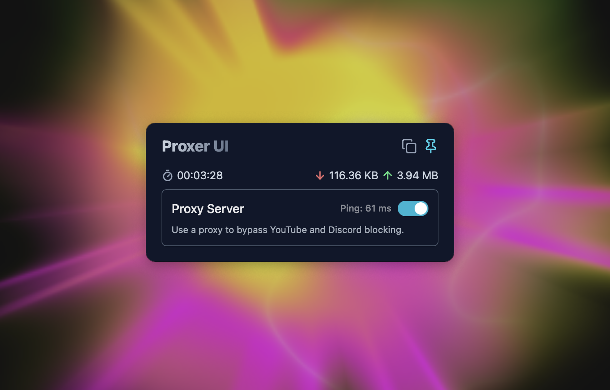

# Proxer

Proxying TCP traffic on macOS with domain filtering via UI



> [!IMPORTANT]
> Please note that the `proxer` repository has been renamed to [`proxer-cli`](https://github.com/doroved/proxer-ui) - this is the open-source version of the proxy client for command-line use.

The current repository is intended for storing releases of the commercial version of Proxer as a UI program for macOS.

Currently, an alpha version has been released for users who need access to YouTube and Discord through our paid proxy.

Subsequent development will implement all the functionality of `proxer-cli` + new features/improvements and will be free until the stable version is released.

The payment model for using Proxer with both your proxies and ours is under development.

Subscribe to our channel on [Telegram](https://t.me/macproxer) to receive information about the program and updates.

## Installation

Currently, installation/update occurs by running `install.sh` from the command line.

In the future, releases will be signed with a certificate, and you will be able to download the application directly.

```bash
curl -fsSL https://raw.githubusercontent.com/doroved/proxer/main/install.sh | bash
```

## Links

[Proxer Channel TG](https://t.me/macproxer) - subscribe to not miss important updates.
